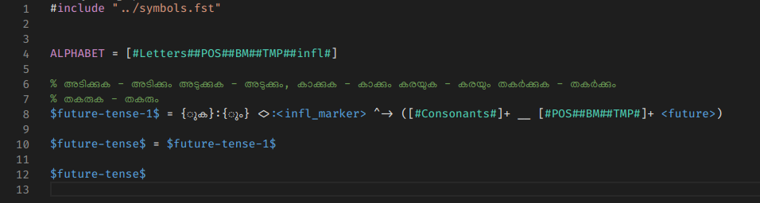

# vscode-sfst: Support for Stuttgart Finite State Transducer (SFST) formalism

This package adds syntax highlighting support for [Stuttgart Finite State Transducer (SFST)](https://www.cis.uni-muenchen.de/~schmid/tools/SFST/) formalism to VS Code.

## Installation

Launch VS Code Quick Open (`Ctrl+P`), paste the following command, and press enter.

```
ext install santhoshthottingal.vscode-sfst
```

## Screenshot



## License

[The MIT License (MIT)](LICENSE.md)
